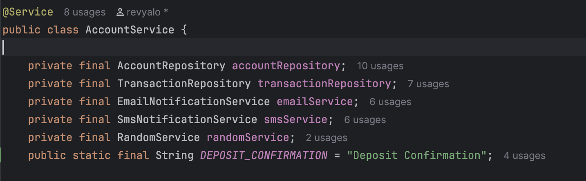
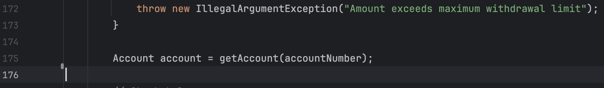
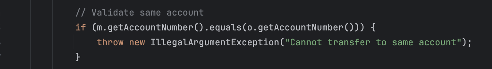
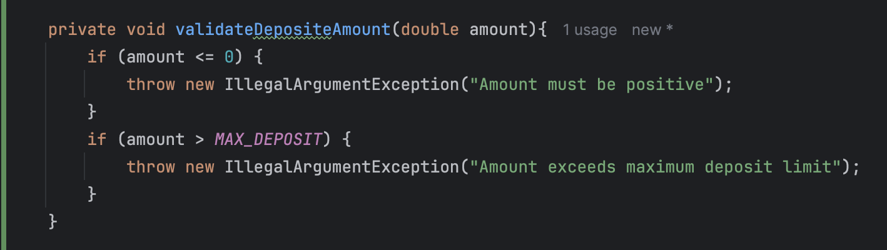
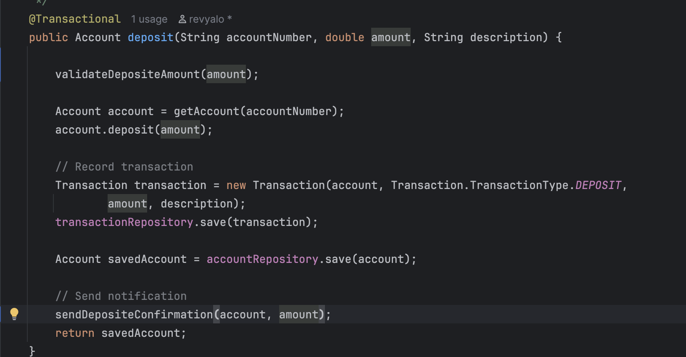
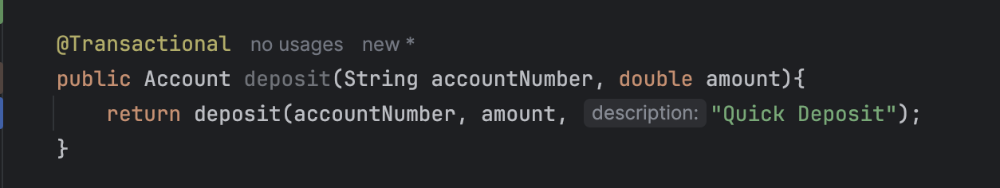
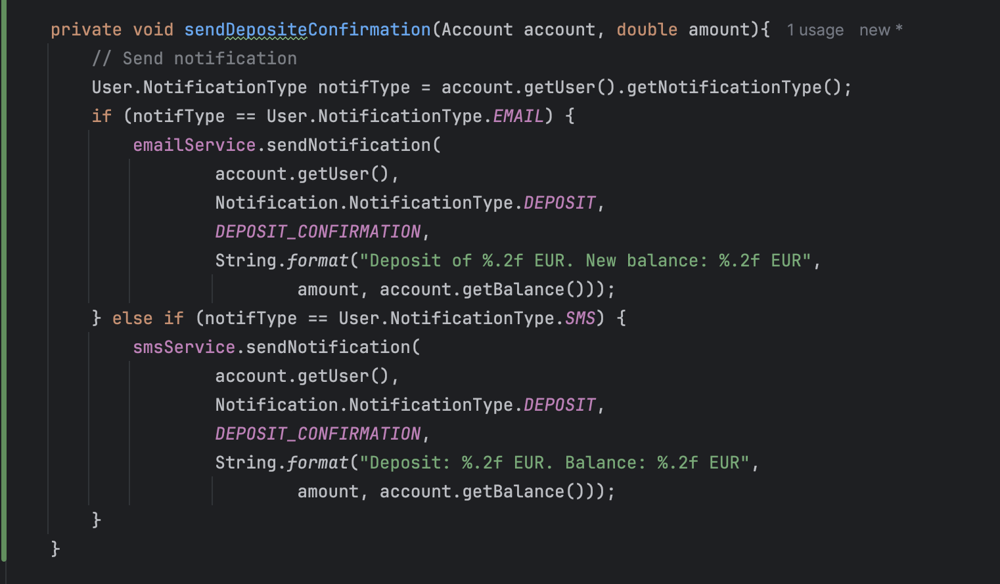
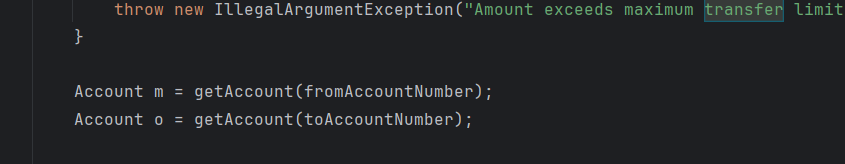
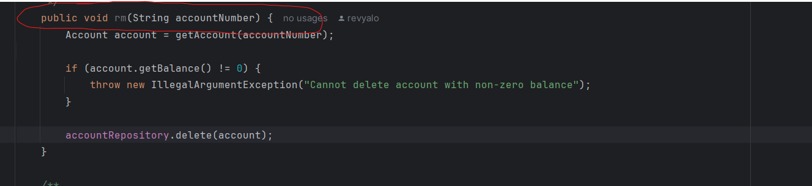

# Tarea 1 y 3: Análisis de Calidad del Código y Refactorización

## Captura de Pantalla del Overview de SonarQube

## Análisis de Calidad - Issues 

A continuación se muestra un resumen de los issues encontrados en el análisis de calidad realizado con SonarQube y mediante el análisis manual del código:

### Issue 1: Duplicación de string

**Reporte de la issue**:

Se ha detectado con Sonar.

**Explicación de los alumnos del mal olor detectado** 
Es un issue real. Se detecta que el String "Deposit Confirmation" esta repetido 4 veces.
Viola el principio DRY (Don´t repeat yourself). Si el banco quisiera cambiar el mensaje de notificación tendría que ir uno a uno cambiando el mensaje.
Afecta en la mantenibilidad con un grado de severidad high.

**Refactorización**

Hemos creado una variable string, que se aplica todas las veces que se menciona tal string.

### Issue 2: Variable local no utilizada ("Second account")

**Reporte de la issue**:

  
**Explicación de los alumnos del mal olor detectado** 
Es un issue real.
Se declara la variable Account seccond account; pero no se le asigna ningún valor útil ni se lee en ningún método.
Basicamente se trata de código muerto.
Afecta en la mantenibilidad con un grado de severidad low.

**Refactorización**

Hemos eliminado la declaración, puesto que no se utiliza.

### Issue 3: Error de logica con '=='

**Reporte de la issue**:

  
**Explicación de los alumnos del mal olor detectado** 
Es un issue real.
En el método transfer se intenta validar la cuenta de origen y la de destino no sean la misma. Sin embargo se usa '==' para comparar el numero de cuenta que es un string, cuando debería usarse un equals, '==' se usa para comparar si dos objetos apuntan a la misma dirección de memoria, esto provocara transferencias incorrectas.

**Refactorización**

Se ha sustituido el "==" por .equals, que nos permite validar correctamente las cuentas. 

### Issue 4: Condicionales inaccesibles y repetidos

**Reporte de la issue**:

  
**Explicación de los alumnos del mal olor detectado** 
Es un issue real.
En el método deposit se han incluido dos condicionales seguidos, un if amount > 10000, y un if amount > 50000. Debido al orden de como están situados estas condiciones, nunca jamás accederá a la segunda condición, el if amount > 50000, básicamente el segundo if es código muerto, y hay condicionales
del mismo método que están separados de forma innecesaria, cuando se podría mejorar la legibilidad.

**Refactorización**

Hacemos el codigo mas modular, para permitir reutilizar esta funcion en otras.
Hemos reducido el espacio del codigo a solamente dos condicionales necesarias, y hemos definido el maximo como un entero por si en el futuro, queremos cambiarlo.

### Issue 5: Duplicación de lógica en los métodos deposit

**Reporte de la issue**:

  
**Explicación de los alumnos del mal olor detectado** 
Issue de diseño
La lógica de diseño está duplicada en ambos métodos. Lo que incumple el principio DRY (Don´t repeat yourself). Código identico en ambos métodos provoca que cualquier cambio de reglas deba replicarse en ambos lugares. 

**Refactorización**

Hemos hecho el codigo mas modular, simplemente reutilizar codigo hecho para no repetir constantemente la logica y hacerlo mas legible, como hemos hecho con la issue 4, hemos desencapsulado la logica de la confirmacion en otra funcion.
El metodo del deposito que no declara ningun string, reutiliza el metodo con un string especificado.

### Issue 6: Nombres de variables no esclarecedoras en el metodo transfer

**Reporte de la issue**

**Explicacion de los alumnos del mal olor detectado**
En el metodo 'transfer', las variables que represtnan la cuenta de origen y la de destino se llaman "m" y "o". Estos nombre como tal no aportan ningun significado y
obligan al lector a leer todo el metodo para saber a que se hacen mencion. El punto de ello esque tiene que ser algo mas 
descriptivo como "cuentaOrigen" y "cuentaDestino" por ejemplo. 

### Issue 7: Nombre de metodos poco descriptivo

**Reporte de la issue**

**Explicacion de los alumnos del mal olor detectado**
Un metodo tan importante como el hecho de eliminar una cuenta bancaria, se llama "rm". Deberia llamarse algo como "deleteAccount"
con el fin que de cualquier desarrollador entienda el propositode de dicho metodo sin necesidad de leer la implementacion.