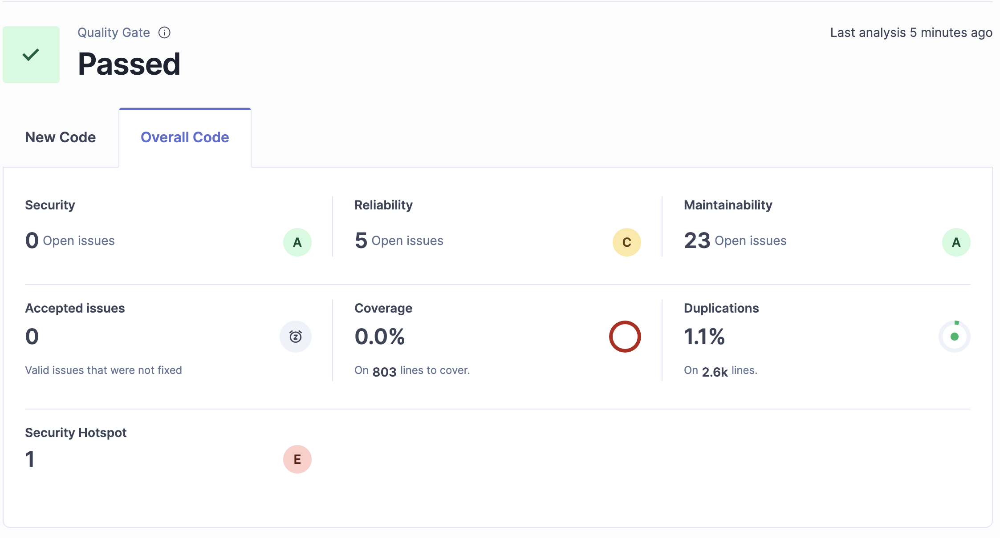
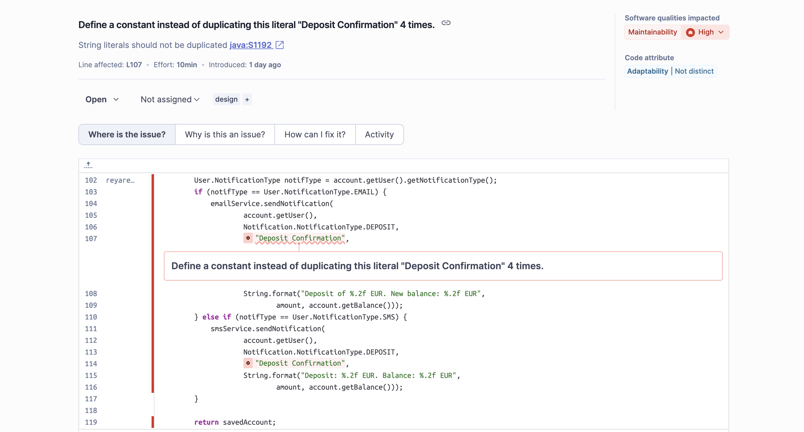
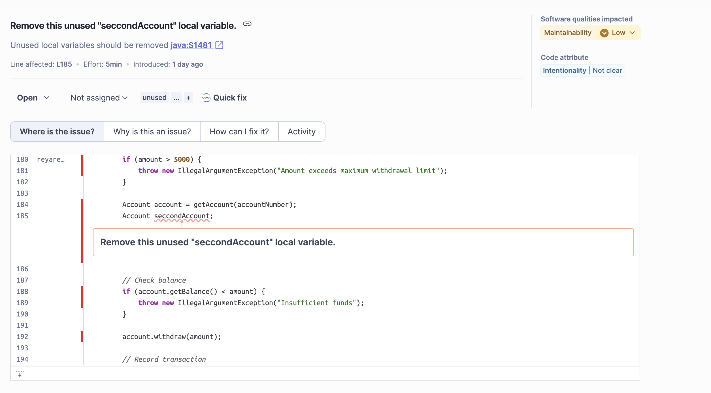
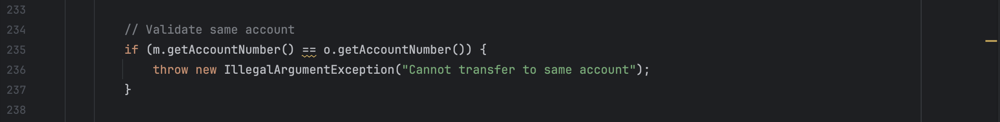
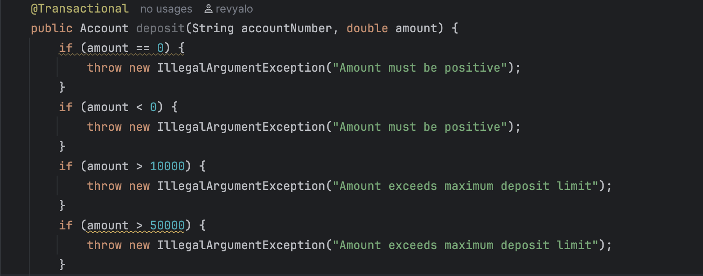
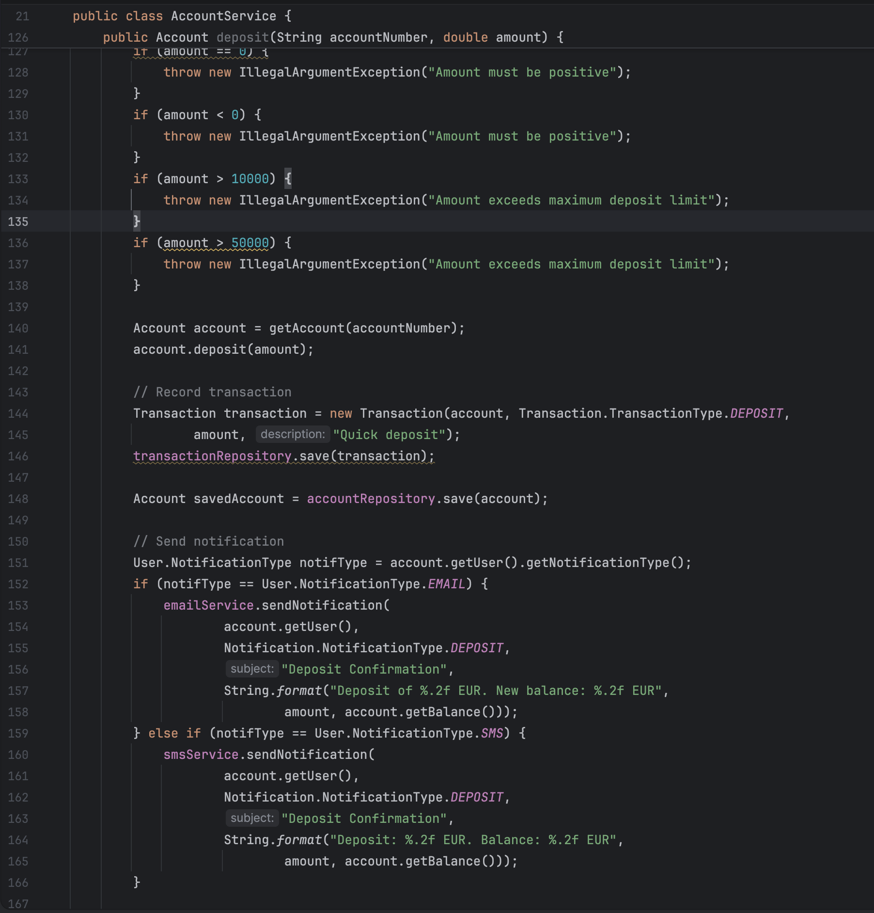
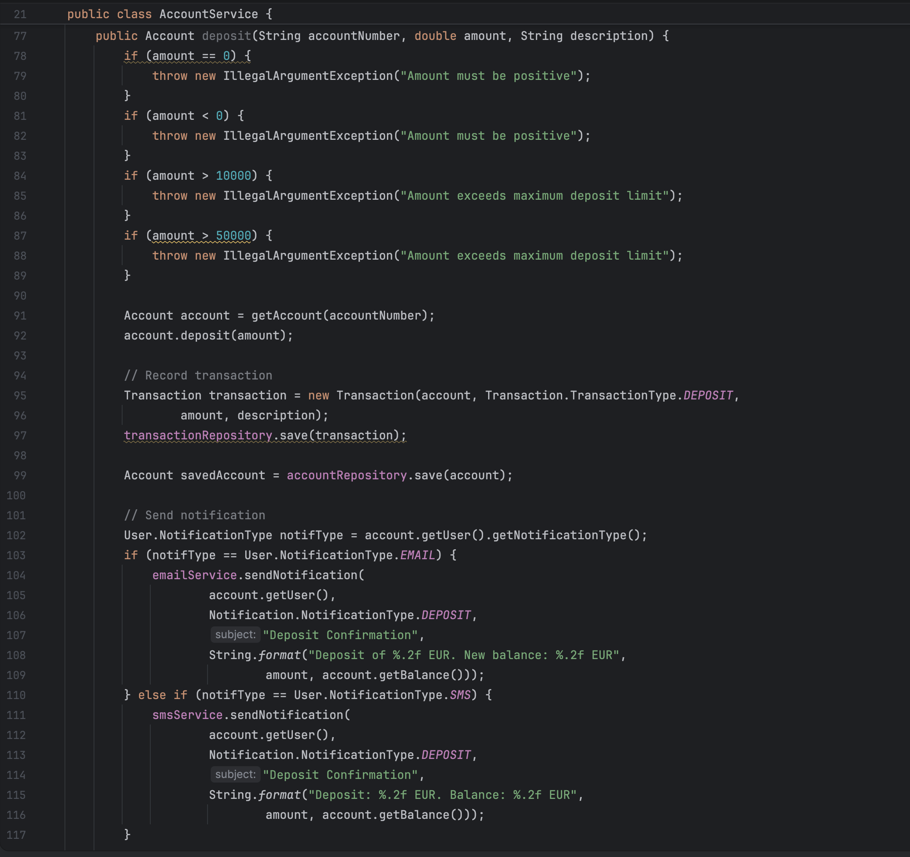

# Tarea 1 y 3: Análisis de Calidad del Código y Refactorización

## Captura de Pantalla del Overview de SonarQube

## Análisis de Calidad - Issues 

A continuación se muestra un resumen de los issues encontrados en el análisis de calidad realizado con SonarQube y mediante el análisis manual del código:

### Issue 1: Duplicación de string

**Reporte de la issue**:

Se ha detectado con Sonar.

**Explicación de los alumnos del mal olor detectado** 
Es un issue real. Se detecta que el String "Deposit Confirmation" esta repetido 4 veces.
Viola el principio DRY (Don´t repeat yourself). Si el banco quisiera cambiar el mensaje de notificación tendría que ir uno a uno cambiando el mensaje.
Afecta en la mantenibilidad con un grado de severidad high.

**Refactorización**

NO REALIZAR HATA LA TAREA 3

Se utilizará una captura de pantalla del código o código resaltado para mostrar la solución. Se acompañará dicha solución de un breve comentario explicándola.

### Issue 2: Variable local no utilizada ("Second account")

**Reporte de la issue**:

  
**Explicación de los alumnos del mal olor detectado** 
Es un issue real.
Se declara la variable Account seccond account; pero no se le asigna ningún valor útil ni se lee en ningún método.
Basicamente se trata de código muerto.
Afecta en la mantenibilidad con un grado de severidad low.

**Refactorización**

NO REALIZAR HATA LA TAREA 3

Se utilizará una captura de pantalla del código o código resaltado para mostrar la solución. Se acompañará dicha solución de un breve comentario explicándola.

### Issue 3: Error de logica con '=='

**Reporte de la issue**:

  
**Explicación de los alumnos del mal olor detectado** 
Es un issue real.
En el método transfer se intenta validar la cuenta de origen y la de destino no sean la misma. Sin embargo se usa '==' para comparar el numero de cuenta que es un string, cuando debería usarse un equals, '==' se usa para comparar si dos objetos apuntan a la misma dirección de memoria, esto provocara transferencias incorrectas.

**Refactorización**

NO REALIZAR HATA LA TAREA 3

Se utilizará una captura de pantalla del código o código resaltado para mostrar la solución. Se acompañará dicha solución de un breve comentario explicándola.

### Issue 4: Nombre de la issue

**Reporte de la issue**:

  
**Explicación de los alumnos del mal olor detectado** 
Es un issue real.
En el método deposit se han incluido dos condicionales seguidos, un if amount > 10000, y un if amount > 50000. Debido al orden de como están situados estas condiciones, nunca jamás accederá a la segunda condición, el if amount > 50000, básicamente el segundo if es código muerto, y hay condicionales
del mismo método que están separados de forma innecesaria, cuando se podría mejorar la legibilidad.

**Refactorización**

NO REALIZAR HATA LA TAREA 3

Se utilizará una captura de pantalla del código o código resaltado para mostrar la solución. Se acompañará dicha solución de un breve comentario explicándola.

### Issue 5: Duplicación de lógica en los métodos deposit

**Reporte de la issue**:

  
**Explicación de los alumnos del mal olor detectado** 
Issue de diseño
La lógica de diseño está duplicada en ambos métodos. Lo que incumple el principio DRY (Don´t repeat yourself). Código identico en ambos métodos provoca que cualquier cambio de reglas deba replicarse en ambos lugares. 

**Refactorización**

NO REALIZAR HATA LA TAREA 3

Se utilizará una captura de pantalla del código o código resaltado para mostrar la solución. Se acompañará dicha solución de un breve comentario explicándola.

