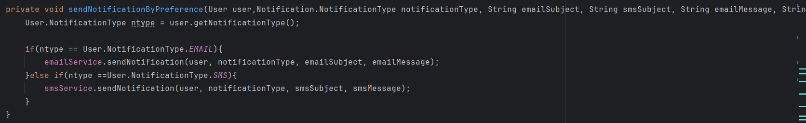
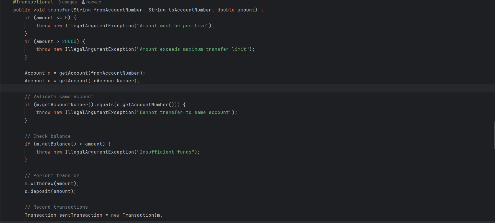
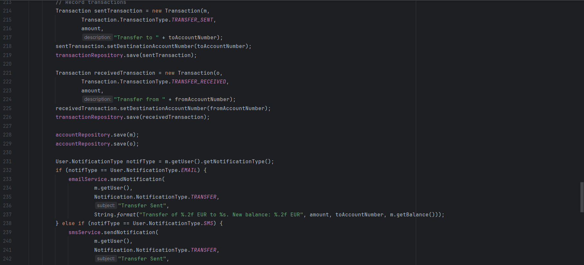
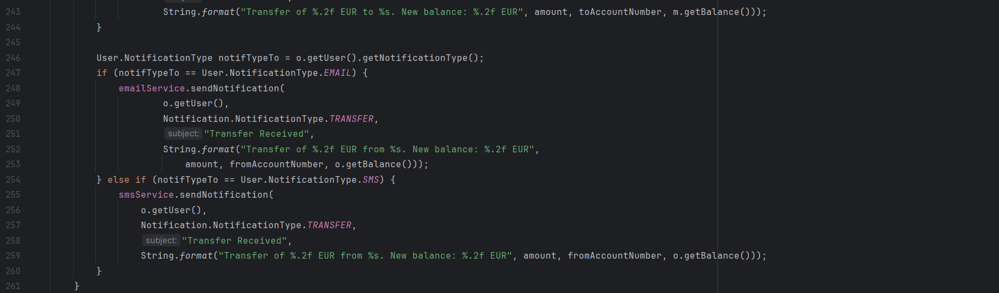
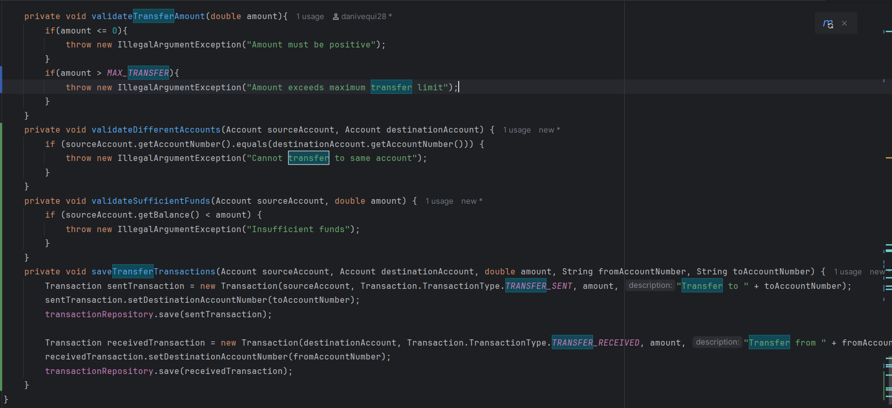
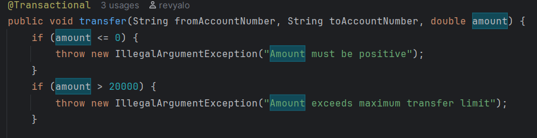
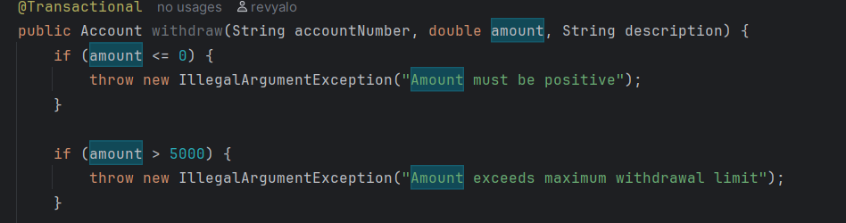
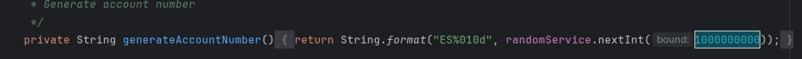
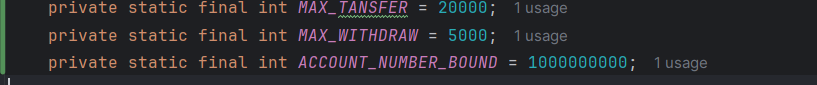

## Análisis de Calidad - Issues 
A continuación se muestra un resumen de los issues encontrados mediante el análisis manual del código:

### Issue 1: Duplicación de código
**Reporte de la issue**:

**Explicación de los alumnos del mal olor detectado**

Es un issue real.
En la clase `AccountService` se repite varias veces la lógica de las notificaciones. En distintos métodos se vuelve a hacer lo mismo: mirar si el usuario quiere recibir la notificación por `EMAIL` o por `SMS` y, según eso, enviarla con un servicio u otro.
Esto es un problema de código duplicado porque la misma lógica está escrita en varios sitios, si más adelante se quisiera cambiar la forma de enviar las notificaciones, añadir otro tipo o modificar los mensajes, habría que tocar varios fragmentos de código en vez de uno solo y eso aumenta la posibilidad de cometer errores.
Además, al estar repetido, el código queda más difícil de mantener y también más difícil de leer.

**Refactorización**

Se ha creado un nuevo método privado que sustituye a los métodos duplicados
### Issue 2: Metodo largo (transfer)
**Reporte de la issue**:

**Explicación de los alumnos del mal olor detectado**

Es un issue real.
En el método `transfer` se hacen demasiadas cosas dentro del mismo bloque. No solo se realiza la transferencia, sino que también se valida la cantidad, se buscan las cuentas, se comprueba que la operación sea válida, se crean y guardan las transacciones, se actualizan las cuentas y se envían notificaciones a los usuarios.
Esto hace que el método esté demasiado cargado y que concentre varias responsabilidades en un único sitio. Como consecuencia, el código se vuelve más difícil de leer, de entender y de mantener, ya que cualquier cambio en una de esas partes obliga a tocar un método muy grande.

**Refactorización**

Se ha dividido el método `Transfer` en varios métodos privados para que la lógica sea más fácil de entender
### Issue 3: Problemas de formato con numeros
**Reporte de la issue**:

**Explicación de los alumnos del mal olor detectado**

Es un issue real.

En la clase `AccountService` aparecen varios valores numéricos escritos directamente en el código, como por ejemplo `5000` para el límite de retirada, `20000` para el límite de transferencia o `1000000000` para la generación del número de cuenta.
Esto supone un problema de calidad porque esos valores no están definidos de manera clara ni uniforme. Al estar escritos directamente en distintos métodos, el código pierde legibilidad y resulta más difícil de mantener ya que si en el futuro cambia alguna de estas reglas habría que localizar y modificar esos valores manualmente.
Además, se observa una inconsistencia, ya que en el caso del depósito sí se utiliza una constante (`MAX_DEPOSIT`), mientras que en otros casos similares no se sigue el mismo criterio.

**Refactorización**

Se ha sacado a constantes los números que antes estaban puestos directamente en el código