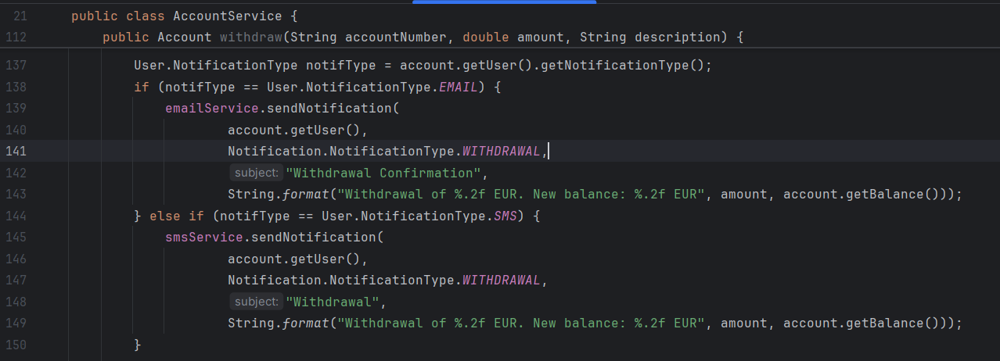
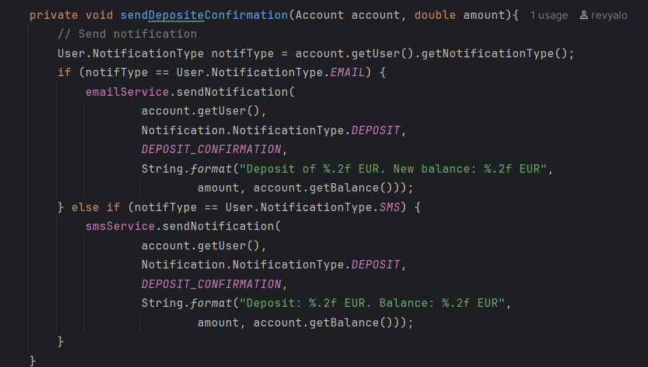
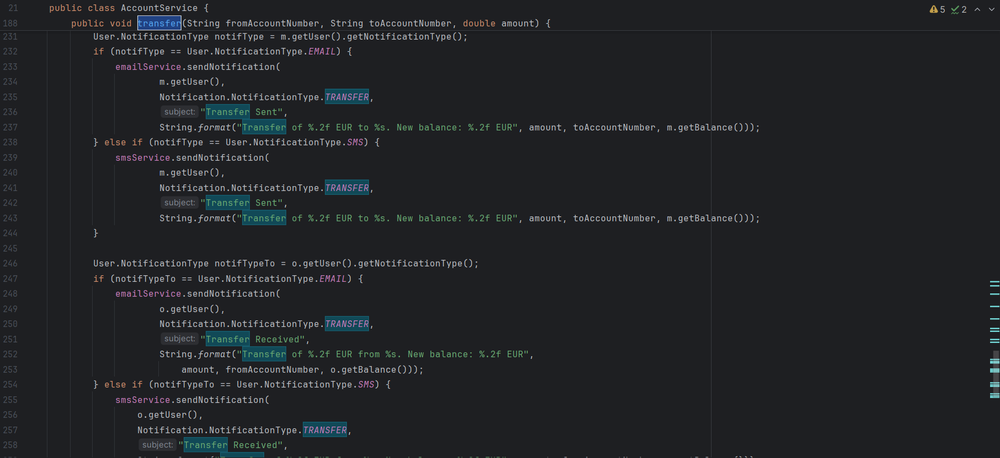

## Análisis de Calidad - Issues 
A continuación se muestra un resumen de los issues encontrados mediante el análisis manual del código:

### Issue 1: Duplicación de código
**Reporte de la issue**:

**Explicación de los alumnos del mal olor detectado**

Es un issue real.
En la clase `AccountService` se repite varias veces la lógica de las notificaciones. En distintos métodos se vuelve a hacer lo mismo: mirar si el usuario quiere recibir la notificación por `EMAIL` o por `SMS` y, según eso, enviarla con un servicio u otro.
Esto es un problema de código duplicado porque la misma lógica está escrita en varios sitios, si más adelante se quisiera cambiar la forma de enviar las notificaciones, añadir otro tipo o modificar los mensajes, habría que tocar varios fragmentos de código en vez de uno solo y eso aumenta la posibilidad de cometer errores.
Además, al estar repetido, el código queda más difícil de mantener y también más difícil de leer.

