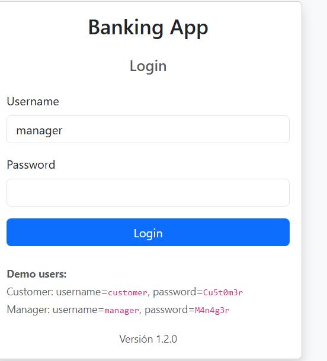
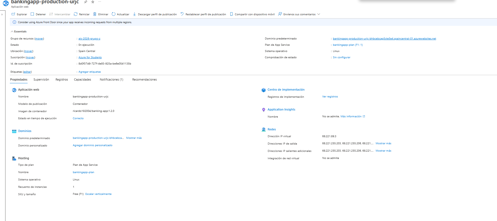

# Práctica 2 - Implementación de pipelines de CI/CD y desarrollo colaborativo

**Grupo Z**

## Miembros del Equipo
| Nombre y Apellidos | Correo URJC | Usuario GitHub |
|:---                 |:---                            |:--- |
| David Arevalo Rey   | d.arevalo.2023@alumnos.urjc.es | revyalo |
| Daniel Vela Quimbay | d.vela.2023@alumnos.urjc.es    | danivequi |
| Ricardo Ullco Lagla | r.ullco.2023@alumnos.urjc.es   | ullco4833-rgb |

---

## Participación de Miembros en la Práctica 2

| Tarea | David Arévalo Rey | Daniel Vela Quimbay                                                                                                                                                                                                                                                                                                                                                                                                                                                                                                                                                                                                                                                                                                                                                                                                                                                                                                                                                                                                                                                      | Ricardo Ullco Lagla                                                                                                                                                                                                                                                                                                                                                                                                                                                         |
|---|---|--------------------------------------------------------------------------------------------------------------------------------------------------------------------------------------------------------------------------------------------------------------------------------------------------------------------------------------------------------------------------------------------------------------------------------------------------------------------------------------------------------------------------------------------------------------------------------------------------------------------------------------------------------------------------------------------------------------------------------------------------------------------------------------------------------------------------------------------------------------------------------------------------------------------------------------------------------------------------------------------------------------------------------------------------------------------------|-----------------------------------------------------------------------------------------------------------------------------------------------------------------------------------------------------------------------------------------------------------------------------------------------------------------------------------------------------------------------------------------------------------------------------------------------------------------------------|
| **Tarea 1 - Preparación del repositorio** | Preparó la rama `p2-tarea1-preparacion-repositorio`, corrigió la configuración de Maven/Surefire eliminando la línea problemática de `argLine`, añadió la propiedad `app.version`, creó `AppVersionControllerAdvice` y modificó el login para mostrar la versión de la aplicación. <br><br>Commits: [9a06487](https://github.com/revyalo/ais-2026-grupo-z/commit/9a06487), [6bc10d6](https://github.com/revyalo/ais-2026-grupo-z/commit/6bc10d6). <br>Merge: [6eac54e](https://github.com/revyalo/ais-2026-grupo-z/commit/6eac54ebe8b6b4be4c05d2f6a5f00250d0371ed5). | Pendiente de completar por el miembro correspondiente.                                                                                                                                                                                                                                                                                                                                                                                                                                                                                                                                                                                                                                                                                                                                                                                                                                                                                                                                                                                                                   | Pendiente de completar por el miembro correspondiente.                                                                                                                                                                                                                                                                                                                                                                                                                      |
| **Tarea 2 - Definición de workflows** | Añadió workflows de GitHub Actions para automatizar la ejecución de pruebas en ramas y Pull Requests. Creó el workflow de pruebas unitarias en ramas y el workflow de pruebas automáticas para Pull Requests. <br><br>Commits: [d6586e8](https://github.com/revyalo/ais-2026-grupo-z/commit/d6586e8), [e4cc6ee](https://github.com/revyalo/ais-2026-grupo-z/commit/e4cc6ee). | Añadió el workflow Nightly para ejecutar pruebas de sistema en varios navegadores y sistemas operativos. También preparó la prueba `TransferE2ETest` para seleccionar navegador mediante una propiedad de Maven y añadió la construcción de una imagen Docker guardada como artefacto. <br><br>Commits: `166c26f`, `d95fc7e`. <br>Pull Request: [PR #7 - Añadir Workflow nightly](https://github.com/revyalo/ais-2026-grupo-z/pull/7).                                                                                                                                                                                                                                                                                                                                                                                                                                                                                                                                                                                                                                                     | Añadió el workflow de despliegue a producción (`main-deploy.yml`) que publica la imagen Docker en Docker Hub, despliega en Azure y ejecuta el SmokeTest. Creó la clase `SmokeTest.java` para verificar la versión desplegada en Azure. Commits: [893fc18](https://github.com/revyalo/ais-2026-grupo-z/commit/893fcf844c9748146865a1598988e0ef82ed8f28), [999011f](https://github.com/revyalo/ais-2026-grupo-z/commit/999011f4c0fc6aae96da807da8908ad46e146df3), [f78b18b](https://github.com/revyalo/ais-2026-grupo-z/commit/f78b18bb59cb6e3f15d7b1fb056929ad53f2119a) |
| **Tarea 3 - Desarrollo colaborativo con GitHubFlow** | Implementó la rama `feature-2`, correspondiente a impedir operaciones de usuarios bloqueados. Añadió el atributo `banned` en la entidad `User`, incorporó validaciones en `AccountService`, añadió pruebas unitarias para usuarios bloqueados y actualizó la versión de la aplicación a `1.1.0`. <br><br>Pull Request: [PR #5 - Tarea 3: impedir operaciones de usuarios bloqueados](https://github.com/revyalo/ais-2026-grupo-z/pull/5). <br>Commit principal: [0cb1931](https://github.com/revyalo/ais-2026-grupo-z/commit/0cb1931). | Implementó la rama `feature-1`, correspondiente a limitar las retiradas acumuladas en las últimas 24 horas. Añadió la validación en `AccountService`, incorporó pruebas unitarias para cubrir la regla de negocio y actualizó la versión de la aplicación a `1.2.0`. <br><br>Pull Request: [PR #6 - Tarea 3: limitar retiradas en 24 horas](https://github.com/revyalo/ais-2026-grupo-z/pull/6). <br>Commits: [40a80fc](https://github.com/revyalo/ais-2026-grupo-z/commit/40a80fcf76363a3970db7a18741dae73e5426c10), [1fd8bb6](https://github.com/revyalo/ais-2026-grupo-z/commit/1fd8bb6c221e68116d0ad936bca3171e5861f8ab), [9165668](https://github.com/revyalo/ais-2026-grupo-z/commit/9165668e5bf39b9fe6ab69b1573c55db70146175), [988519b](https://github.com/revyalo/ais-2026-grupo-z/commit/988519b209cd44bec8c067400d5b070cfcd8e3a9), [b725f3b](https://github.com/revyalo/ais-2026-grupo-z/commit/b725f3bf7bedb1e1b6e78125715e03d893a94cab). <br>Merge: [20645b5](https://github.com/revyalo/ais-2026-grupo-z/commit/20645b5a1be4fcf4be93e595592e7ed3cdd45c41). | Pendiente de completar la parte asignada por el grupo.                                                                                                                                                                                                                                                                                                                                                                                                                      |
| **Tarea 4 - Realización de la memoria** | Actualizó la memoria en `README.md` documentando la parte realizada: preparación del repositorio, workflows iniciales, rama `feature-2`, Pull Requests, comandos Git utilizados y evidencias de ejecución. | Actualizó la memoria en `README.md` documentando su participación en `feature-1` y en el workflow Nightly, incluyendo Pull Requests, commits realizados, pruebas ejecutadas, versión `1.2.0` y evidencias de GitHub Actions pendientes de completar cuando estén disponibles.                                                                                                                                                                                                                                                                                                                                                                                                                                                                                                                                                                                                                                                                                                                                                                        | Pendiente de completar por el miembro correspondiente.                                                                                                                                                                                                                                                                                                                                                                                                                      |

---

## Desarrollo con GitHubFlow

### Asignación de tareas

Durante la práctica se ha seguido un flujo de trabajo basado en GitHubFlow. Cada funcionalidad o tarea se ha desarrollado en una rama independiente creada a partir de `main`. Después, los cambios se han integrado mediante Pull Requests revisados y validados con workflows de GitHub Actions.

| Tarea | Responsable | Estado     |
|---|---|------------|
| Tarea 1 - Preparación del repositorio | David Arévalo Rey | Completada |
| Tarea 2 - Workflows de pruebas en ramas y Pull Requests | David Arévalo Rey | Completada |
| Tarea 2 - Workflow Nightly | Daniel Vela Quimbay | Completada |
| Tarea - Workflow main-deply | Ricardo Ullco Lagla | Completada |
| Tarea 3 - Feature 2: impedir operaciones de usuarios bloqueados | David Arévalo Rey | Completada |
| Tarea 3 - Feature 1: limitar retiradas acumuladas en 24 horas | Daniel Vela Quimbay | Completada |
| Tarea 4 - Memoria | Grupo Z | En proceso |

### Pasos seguidos

#### 1. Actualización de la rama principal

Antes de comenzar cada tarea se actualizó la rama `main` para partir siempre de la última versión del proyecto:
```bash
git checkout main
git pull origin main
```

Git checkout main para cambiar a la rama `main` del repositorio
Git pull origin main descarga e integra los ultimos cambios de Github

#### 2. Ramas de trabajo

Para la tarea 1:
```bash
git checkout -b p2-tarea1-preparacion-repositorio
```

Para la tarea 2:
```bash
git checkout -b p2-tarea2-workflows
git checkout -b p2-tarea2-pr-workflow
```

Para el workflow Nightly, Daniel Vela Quimbay creó la rama `workflow-nightly` a partir de `main`:
```bash
git checkout main
git pull origin main
git checkout -b workflow-nightly
```

Para la tarea 3 en la funcionalidad feature-2:
```bash
git checkout -b feature-2
```

Para la tarea 3 en la funcionalidad feature-1:
```bash
git checkout -b feature-1
```
El comando git checkout -b crea una nueva rama y cambia automaticamente a ella

#### 3. Comprobacion de cambios
Durante el desarrollo se uso la siguiete funcion para comprobar el estado del repo

```bash
git status
```
Permite ver la rama actual, ficheros actualizados, los nuevos y si hay cambios pendientes de commit.

#### 4. Ejecución de pruebas en local.
Antes de subir los cambios se ejecutaron las pruebas con Maven

```bash
mvn clean test
```

Limpia el directorio, recompila el proyecto y ejecuta las pruebas automaticas

En la rama feature-2, hubo un problema con las pruebas unitarias devido al formato de los mensajes, que se soluciono corredctamente.

#### 5. Preparacion de commits
Una vez realizado unos cambios se añadieron los ficheros modificados
```bash
git add pom.xml
git add src/main/java/es/codeurjc/model/User.java
git add src/main/java/es/codeurjc/service/AccountService.java
git add src/test/java/es/codeurjc/unit/AccountServiceTest.java```
```

El comando git add indica que ficheros se incluiran en el siguiente commit.
Despues se crearia el siguiente commit correspondiente:

```bash
git commit -m "Tarea 3: impedir operaciones de usuarios bloqueados"
```
El comando git commit guarda los cambios en el historial local del repositorio

#### 6. Subida de la rama al repositorio remoto
Despues de crear el commit, se subio la rama a Github
```bash
git push origin feature-2
```
Publicamos la rama local feature-2 en el repositorio remoto

#### 7. Creación y revision del Pull Request
Con la rama subida a GitHub, se crea su Pull Request correspondiente:

[PR #5 - Tarea 3: impedir operaciones de usuarios bloqueados](https://github.com/revyalo/ais-2026-grupo-z/pull/5)
En este Pull Request se ejecutaron los workflows configurados para validar automáticamente los cambios. Finalmente, los checks aparecieron en verde, por lo que la rama quedó lista para revisión e integración.

Para la rama `feature-1`, Daniel Vela Quimbay abrió el Pull Request correspondiente:

[PR #6 - Tarea 3: limitar retiradas en 24 horas](https://github.com/revyalo/ais-2026-grupo-z/pull/6)

En este Pull Request se validó la funcionalidad con los workflows de GitHub Actions. La rama no presentaba conflictos con `main` y los checks aparecieron en verde antes de realizar el merge.

## Cambios realizados en `feature-1`

La rama `feature-1` fue implementada por Daniel Vela Quimbay y añade una regla de negocio para limitar las retiradas acumuladas de una cuenta durante las últimas 24 horas.

### Funcionalidad implementada

Se modificó `AccountService` para validar las retiradas antes de modificar el saldo de la cuenta.

La regla implementada establece que una cuenta no puede retirar una cantidad que, sumada a lo retirado durante las últimas 24 horas, sea igual o superior a `5000`.

Si el total acumulado durante las últimas 24 horas más la nueva retirada solicitada es igual o superior a `5000`, la operación se cancela y el saldo no se modifica.

### Pruebas añadidas

Se añadieron pruebas unitarias en `AccountServiceTest` para comprobar:

- Que se permite una retirada si el total acumulado durante las últimas 24 horas es menor que `5000`.
- Que se rechaza una retirada si el total acumulado supera `5000`.
- Que se rechaza una retirada si el total acumulado es exactamente `5000`.
- Que no se cuentan retiradas anteriores a 24 horas.
- Que el saldo no cambia cuando la retirada se cancela.

Además, se corrigieron comprobaciones de mensajes de notificación para que los tests no dependan del formato decimal usado por el entorno de ejecución.

### Cambio de versión

Se actualizó la versión de la aplicación en `pom.xml`:

    <version>1.2.0</version>

Este cambio identifica la incorporación de la nueva funcionalidad `feature-1`.

### Pull Request y commits

Pull Request: [PR #6 - Tarea 3: limitar retiradas en 24 horas](https://github.com/revyalo/ais-2026-grupo-z/pull/6)

Commits de la rama `feature-1`:

- `40a80fcf76363a3970db7a18741dae73e5426c10` - limitar retiradas en 24 horas.
- `1fd8bb6c221e68116d0ad936bca3171e5861f8ab` - añadir pruebas para límite de retiradas.
- `9165668e5bf39b9fe6ab69b1573c55db70146175` - Bump version to 1.2.0.
- `988519b209cd44bec8c067400d5b070cfcd8e3a9` - test error.
- `b725f3bf7bedb1e1b6e78125715e03d893a94cab` - solucion test.

Merge final en `main`:

- `20645b5a1be4fcf4be93e595592e7ed3cdd45c41` - Merge pull request #6 from revyalo/feature-1.

## Cambios realizados en `feature-2`

La rama `feature-2` implementa la funcionalidad para impedir operaciones bancarias a usuarios bloqueados.

### Cambios en `User`

Se añadió el atributo `banned` a la entidad `User`:

```Java
    private boolean banned = false;
```

También se añadieron sus métodos de acceso:


```Java
    public boolean isBanned() {
        return banned;
    }

    public void setBanned(boolean banned) {
        this.banned = banned;
    }
```
    
Este atributo permite marcar a un usuario como bloqueado.

### Cambios en `AccountService`

Se añadió una validación para comprobar si el usuario propietario de una cuenta está bloqueado antes de permitir operaciones bancarias.

La validación se aplica en operaciones como:

- Ingresos.
- Retiradas.
- Transferencias desde una cuenta origen.
- Transferencias hacia una cuenta destino.

Si el usuario está bloqueado, se lanza una excepción y no se realiza la operación.

### Cambios en pruebas unitarias

Se añadieron pruebas unitarias en `AccountServiceTest` para comprobar que no se permiten operaciones con usuarios bloqueados:

- No permite ingresar dinero si el usuario está bloqueado.
- No permite retirar dinero si el usuario está bloqueado.
- No permite transferir dinero si el usuario origen está bloqueado.
- No permite transferir dinero si el usuario destino está bloqueado.

Además, se corrigieron las comprobaciones de mensajes de notificación para adaptarlas al formato decimal utilizado por el servicio.

### Cambio de versión

Se actualizó la versión de la aplicación en `pom.xml`:

    <version>1.1.0</version>

## Workflows de GitHub Actions

### Workflow de pruebas en ramas

Se añadió un workflow para ejecutar pruebas automáticamente al trabajar con ramas de desarrollo.

Evidencia: [Commit workflow ramas](https://github.com/revyalo/ais-2026-grupo-z/commit/d6586e8)

Este workflow permite detectar errores antes de abrir o integrar cambios en `main`.

### Workflow de Pull Requests

Se añadió un workflow que se ejecuta al abrir o actualizar un Pull Request.

Evidencia: [Commit workflow Pull Requests](https://github.com/revyalo/ais-2026-grupo-z/commit/e4cc6ee)

En el caso de la rama `feature-2`, el Pull Request asociado ejecutó correctamente los checks:

[PR #5 - Tarea 3: impedir operaciones de usuarios bloqueados](https://github.com/revyalo/ais-2026-grupo-z/pull/5)

## Despliegue en Azure

La aplicación ha sido desplegada en Azure App Service mediante el workflow `main-deploy.yml`.

- URL pública: https://bankingapp-production-urjc-bhbcebcag5cte5e4.spaincentral-01.azurewebsites.net
Cuando el despliegue esté realizado se añadirá:




## Workflow de Nightly

Daniel Vela Quimbay implementó el workflow Nightly en la rama `workflow-nightly`.

El workflow se encuentra en:

```text
.github/workflows/nightly.yml
```

### Ejecución del workflow

El workflow Nightly se ejecuta automáticamente cada noche sobre la rama `main` mediante la siguiente planificación:

```yaml
cron: "0 2 * * *"
```

También puede lanzarse manualmente desde GitHub Actions mediante `workflow_dispatch`.

### Pruebas de sistema

El workflow ejecuta la prueba de sistema `TransferE2ETest`, que comprueba transferencias bancarias desde la interfaz web de la aplicación.

Para permitir la ejecución en distintos navegadores, se adaptó `TransferE2ETest` para seleccionar el navegador mediante la propiedad de Maven `browser`:

```bash
mvn test -Dtest=TransferE2ETest -Dbrowser=chrome
mvn test -Dtest=TransferE2ETest -Dbrowser=firefox
mvn test -Dtest=TransferE2ETest -Dbrowser=edge
mvn test -Dtest=TransferE2ETest -Dbrowser=safari
```

La matriz del workflow ejecuta la prueba en las siguientes combinaciones:

- Chrome en `ubuntu-latest`.
- Firefox en `ubuntu-latest`.
- Chrome en `windows-latest`.
- Firefox en `windows-latest`.
- Edge en `windows-latest`.
- Chrome en `macos-latest`.
- Firefox en `macos-latest`.
- Safari en `macos-latest`.

Safari se ejecuta únicamente en macOS y requiere habilitar `safaridriver` antes de lanzar la prueba.

### Artefacto Docker Nightly

Si todas las pruebas de sistema pasan correctamente, el workflow construye una imagen Docker local de la aplicación:

```bash
docker build -t banking-app:nightly-fecha .
```

La imagen se guarda como archivo `.tar` mediante `docker save` y se sube como artefacto del workflow con un nombre de tipo:

```text
banking-app-nightly-YYYYMMDD
```

Este artefacto permite conservar la imagen generada por la ejecución Nightly sin publicarla en DockerHub.

### Evidencias

Pull Request: [PR #7 - Añadir Workflow nightly](https://github.com/revyalo/ais-2026-grupo-z/pull/7).

Commits principales:

- `166c26f8e0576b9beaf777bcf42db8fc4d3c68be` - Permite seleccionar navegador para la prueba.
- `d95fc7e28d933fcb83c87d71fa5ac6e4b6160734` - añadir workflow nightly.

Última ejecución del workflow en verde: pendiente de añadir tras integrar el workflow en `main` y ejecutar el workflow correctamente.

Artefacto generado: pendiente de añadir tras la primera ejecución correcta del workflow Nightly.

### **Participación de Miembros en la Práctica 1**

#### **Alumno 1 - David Arévalo Rey**

He participado en las diferentes tareas de la practica, preparando el repositorio para evitar conflictos futuros, la apotacion de diferenctes detecciones de calidad con diferentes herramientas, su respectiva refactorizacion, la creacion de varias pruebas unitarias, dos casos TDD y dos pruebas de Selenium 

| Nº    | Commits      |
|:------------: |:------------:|
|1| [Issue detectada](https://github.com/revyalo/ais-2026-grupo-z/commit/a9dfde9ae07436ce59379877ae1740aa405bd84a)|
|2| [Prueba unitaria implementada](https://github.com/revyalo/ais-2026-grupo-z/commit/b69370af7430b8d80c3319b3a1897353b8833602)  |
|3| [Refactorización implementada](https://github.com/revyalo/ais-2026-grupo-z/commit/8c9e03e738bf6314286f3248499d2441e29b2a8b)  |
|4| [Caso de TDD implementado](https://github.com/revyalo/ais-2026-grupo-z/commit/ecb938d019027eef9430168b494cb128b0a9e877)  |
|5| [Prueba de sistema implementada](https://github.com/revyalo/ais-2026-grupo-z/commit/ed36d5a7029772356d88335501829f19382e7dc1)  |

---

#### **Alumno 2 - Daniel Vela Quimbay**

He participado en las diferentes tareas de la práctica aportando la detección de 3 issues de calidad, varias pruebas unitarias, al refactorización de los issues  encontrados, dos casos de TDD y dos prueba de sistema web con Selenium para comprobar la funcionalidad de transferencias.

| Nº    | Commits      |
|:------------: |:------------:|
|1| [Issue 1 detectada](https://github.com/revyalo/ais-2026-grupo-z/commit/03aeb214e948c135283c1b2f164ceddbe4cb2f9b)<br>[Issue 2 y 3 detectada](https://github.com/revyalo/ais-2026-grupo-z/commit/c4c74e97c3355a8e0ab95d366d184bc3c058c9ac) |  
|2| [Prueba unitaria implementada](https://github.com/revyalo/ais-2026-grupo-z/commit/54d910afc9fbf36f1e394275a2cfbce84885c9a4)  |
|3| [Refactorización implementada](https://github.com/revyalo/ais-2026-grupo-z/commit/144182f941ef3f621dc26fe9df38ac6fcdf45942)  |
|4| [Caso de TDD implementado](https://github.com/revyalo/ais-2026-grupo-z/commit/9147cafd0413f61686cdb2d98623f1be879c7ddf)  |
|5| [Prueba de sistema implementada](https://github.com/revyalo/ais-2026-grupo-z/commit/29c849ed0a901961ea47964b8dc11435f84f00d5)  |

---

#### **Alumno 3 - Ricardo Ullco Lagla**

He participado en las diferentes tareas de la práctica aportando la detección de 2 issues de calidad y su posterior refactorizacion, 3 pruebas unitarias, dos casos de 
TDD y dos prueba de sistema web con Selenium para comprobar la funcionalidad de transferencias

| Nº    | Commits      |
|:------------: |:------------:|
|1| [Issue detectada](https://github.com/revyalo/ais-2026-grupo-z/commit/bb101b1e52b9fe2ef62df78fbae8c30f748c0174)  |
|2| [Prueba unitaria implementada](https://github.com/revyalo/ais-2026-grupo-z/commit/a043ef8d1b291260fb53b224454e51db896bd9e4)  |
|3| [Refactorización implementada](https://github.com/revyalo/ais-2026-grupo-z/commit/fc9df951d3f8b0afda81bc40c5e4cc24f70e6c59)  |
|4| [Caso de TDD implementado](https://github.com/revyalo/ais-2026-grupo-z/commit/c0d6b9e8a9ae8257e57f432fc78e1ddfaa9bc30e)  |
|5| [Prueba de sistema implementada](https://github.com/revyalo/ais-2026-grupo-z/commit/6d82a00c96f438f4d2613b30553e5763642052d0)  |
