# Tarea 4: Implementación de una funcionalidad con TDD 

Se proporciona un ejemplo de cómo reportar la implementación de una funcionalidad utilizando TDD. 

### Se rechaza el pago si esta fuera del rango menor a 1000€


**Código de test**
```java
    @Test
    @DisplayName("Estrategia TDD: Se rechaza el prestamo si tiene un valor menor a 1000")
    void algorithm_less_than_1000(){
        LoanRequest request = new LoanRequest();
        request.setAmount(500.0);
        request.setTermMonths(24);
        request.setCustomerBalance(5000.0);
        request.setMonthlyIncome(2000.0);

        LoanEvaluationResult result = algorithm.evaluate(request);

        assertFalse(result.isApproved(), "Este prestamo debe rechazarse");
        assertEquals("Valor fuera del rango", result.getReason());
    }
```

**Mensaje del test añadido que NO PASA**

```log
org.opentest4j.AssertionFailedError: Este prestamo debe rechazarse ==> 
Expected :false
Actual   :true
```

**Código mínimo para que el test pase**

Mediante condicionales verificamos el valor de request, si es menor que 1000 devolvemos un false con su comentario

```java
    public LoanEvaluationResult evaluate(LoanRequest request) {
        if (request.getAmount() < 1000.0) {
            return new LoanEvaluationResult(false ,"Valor fuera de rango");
        }
        return new LoanEvaluationResult(true, "Aprobado");
    }
```

**Captura de que TODOS los test PASAN**

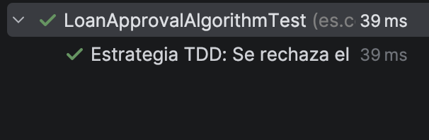

**Refactorización**
> [BORRAR]  Solo si se considera necesario

Justificar vuestra refactorización aquí.

```java
public String convert(int number){
    return "I"; // Imaginemos que hemos refactorizado aquí
}
```


### Se rechaza el pago si esta fuera del rango mayor a 1000€


**Código de test**
```java
    @Test
    @DisplayName("Estrategia TDD: Se rechaza el prestamo si tiene un valor mayor a 5000")
    void algorithm_greather_than_5000(){
        LoanRequest request = new LoanRequest();
        request.setAmount(500000.0);
        request.setTermMonths(24);
        request.setCustomerBalance(5000.0);
        request.setMonthlyIncome(2000.0);

        LoanEvaluationResult result = algorithm.evaluate(request);

        assertFalse(result.isApproved(), "Este prestamo debe rechazarse");
        assertEquals("Valor fuera de rango", result.getReason());
    }
```

**Mensaje del test añadido que NO PASA**

```log
org.opentest4j.AssertionFailedError: Este prestamo debe rechazarse ==> 
Expected :false
Actual   :true
```

**Código mínimo para que el test pase**

Hemos añadido otra condicion adicional para verificar si es mayor al valor estimado.

```java

    public LoanEvaluationResult evaluate(LoanRequest request) {
        if (request.getAmount() < 1000.0 || request.getAmount() > 50000.0) {
            return new LoanEvaluationResult(false ,"Valor fuera de rango");
        }
        return new LoanEvaluationResult(true, "Aprobado");
    }
```

**Captura de que TODOS los test PASAN**

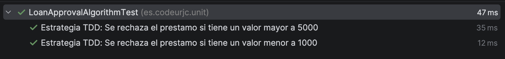


### Se rechaza el pago si es menor del plazo de 6 meses


**Código de test**
```java
    @Test
    @DisplayName("Estrategia TDD: Se rechaza el prestamo si tiene un plazo menor a 6 meses")
    void algorithm_termOutRange(){
        LoanRequest request = new LoanRequest();
        request.setAmount(1500.0);
        request.setTermMonths(4);
        request.setCustomerBalance(5000.0);
        request.setMonthlyIncome(2000.0);

        LoanEvaluationResult result = algorithm.evaluate(request);

        assertFalse(result.isApproved(), "Este prestamo debe rechazarse por plazo invalido");
        assertEquals("Valor fuera de plazo", result.getReason());
    }
```

**Mensaje del test añadido que NO PASA**

```log
org.opentest4j.AssertionFailedError: Este prestamo debe rechazarse por plazo invalido ==> 
Expected :false
Actual   :true
```

**Código mínimo para que el test pase**

Hemos añadido otra condicion adicional para verificar si es menor al plazo indicado, entregando un error en caso de que se cumpla

```java

        if(request.getTermMonths() < 6){
            return new LoanEvaluationResult(false ,"Plazo fuera de rango");
        }
```

**Captura de que TODOS los test PASAN**

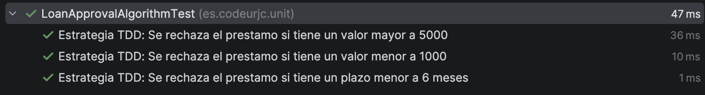


### Se rechaza el pago si es mayor del plazo de 120 meses


**Código de test**
```java
    @Test
    @DisplayName("Estrategia TDD: Se rechaza el prestamo si tiene un plazo mayor a 120 meses")
    void algorithm_termOutRangeGT120(){
        LoanRequest request = new LoanRequest();
        request.setAmount(1500.0);
        request.setTermMonths(121);
        request.setCustomerBalance(5000.0);
        request.setMonthlyIncome(2000.0);

        LoanEvaluationResult result = algorithm.evaluate(request);

        assertFalse(result.isApproved(), "Este prestamo debe rechazarse por plazo invalido");
        assertEquals("Plazo fuera de rango", result.getReason());
    }
```

**Mensaje del test añadido que NO PASA**

```log
org.opentest4j.AssertionFailedError: Este prestamo debe rechazarse por plazo invalido ==> 
Expected :false
Actual   :true
```

**Código mínimo para que el test pase**

Hemos añadido otra condicion adicional para verificar si es mayor al plazo indicado, entregando un error en caso de que se cumpla

```java

        if (request.getTermMonths() < 6 || request.getTermMonths() > 120){
            return new LoanEvaluationResult(false ,"Plazo fuera de rango");

        }
```

** Captura de que TODOS los test PASAN**

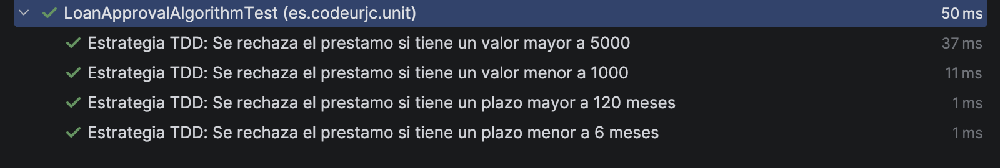


**EJ1. Refactorización**

Hasta ahora hemos usado variables para definir aquellos valores que se repiten y que sean mas faciles de cambiar.

```java
public class LoanApprovalAlgorithm {

    private static final double MIN_AMOUNT = 1000.0;
    private static final double MAX_AMOUNT = 50000.0;
    private static final String VALUE_OUT = "Valor fuera de rango";

    private static final int MIN_TERM = 6;
    private static final int MAX_TERM = 120;
    private static final String TERM_OUT = "Plazo fuera de rango";

    public LoanEvaluationResult evaluate(LoanRequest request) {
        if (request.getAmount() < 1000.0 || request.getAmount() > 50000.0) {
            return new LoanEvaluationResult(false ,"Valor fuera de rango");
        }

        if (request.getTermMonths() < 6 || request.getTermMonths() > 120){
            return new LoanEvaluationResult(false ,"Plazo fuera de rango");

        }
        return new LoanEvaluationResult(true, "Aprobado");
    }
}
```


**Captura de que TODOS los tests PASAN tras la refactorización**

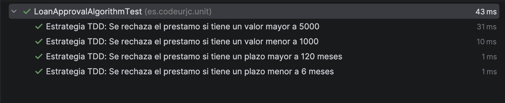


### Se rechaza el préstamo si el saldo es insuficiente (menor al 20% de la cantidad)


**Código de test**
```java
@Test
@DisplayName("Estrategia TDD: Se rechaza el prestamo si el saldo es insuficiente")
void algorithm_insufficientBalance() {
    LoanRequest request = new LoanRequest();
    request.setAmount(20000.0);
    request.setTermMonths(24);
    request.setCustomerBalance(3000.0);
    request.setMonthlyIncome(3000.0);

    LoanEvaluationResult result = algorithm.evaluate(request);

    assertFalse(result.isApproved(), "Deberia rechazarse este prestamo pues el saldo es insuficiente");
    assertEquals("Saldo insuficiente", result.getReason());
}
```

**Mensaje del test añadido que NO PASA**

```log
org.opentest4j.AssertionFailedError: Deberia rechazarse este prestamo pues el saldo es insuficiente 
Expected: false 
Actual: true
```

**Código mínimo para que el test pase**

Se añade una comprobación que verifica si el saldo del cliente es menor al 20% de la cantidad solicitada.

```java
public LoanEvaluationResult evaluate(LoanRequest request) {
    if (request.getAmount() < MIN_AMOUNT || request.getAmount() > MAX_AMOUNT) {
        return new LoanEvaluationResult(false, VALUE_OUT);
    }

    if (request.getTermMonths() < MIN_TERM || request.getTermMonths() > MAX_TERM) {
        return new LoanEvaluationResult(false, TERM_OUT);
    }

    if (request.getCustomerBalance() < request.getAmount() * 0.20) {
        return new LoanEvaluationResult(false, "Saldo insuficiente");
    }

    return new LoanEvaluationResult(true, "Aprobado");
}
```

**Captura de que TODOS los test PASAN**


### Se aprueba un préstamo con datos válidos

**Código de test**
```java
@Test
@DisplayName("Estrategia TDD: Se aprueba un prestamo con datos validos")
void algorithm_approvedBasic() {
    LoanRequest request = new LoanRequest();
    request.setAmount(20000.0);
    request.setTermMonths(24);
    request.setCustomerBalance(5000.0);
    request.setMonthlyIncome(3000.0);

    LoanEvaluationResult result = algorithm.evaluate(request);

    assertTrue(result.isApproved(), "Este prestamo debe aprobarse");
    assertEquals("Aprobado", result.getReason());
}
```

**Mensaje del test añadido que NO PASA**

Este test pasa directamente porque el caso base de aprobación ya se implementó como retorno por defecto en ciclos anteriores. No se trata de código adelantado, sino que el flujo natural del método devuelve "Aprobado" cuando no se cumple ninguna condición de rechazo.

**Captura de que TODOS los test PASAN**

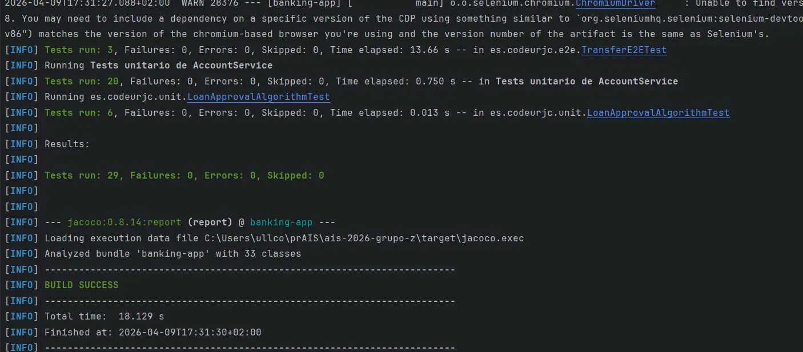


### Un préstamo aprobado con Euribor al 3% tiene un tipo de interés del 5%

**Código de test**
```java
@Test
@DisplayName("Estrategia TDD: Un prestamo aprobado con Euribor al 3% tiene un tipo de interes del 5%")
void algorithm_interestRate_euribor3() {
    when(euriborService.getEuribor()).thenReturn(3.0);

    LoanRequest request = new LoanRequest();
    request.setAmount(20000.0);
    request.setTermMonths(24);
    request.setCustomerBalance(5000.0);
    request.setMonthlyIncome(3000.0);

    LoanEvaluationResult result = algorithm.evaluate(request);

    assertTrue(result.isApproved());
    assertEquals(5.0, result.getInterestRate());
}
```

**Mensaje del test añadido que NO PASA**

```log
org.opentest4j.AssertionFailedError: 
Expected: 5.0 
Actual: 0.0
```

**Código mínimo para que el test pase**

Se modifica el método para que calcule el tipo de interés sumando el interés base del banco (2%) y el Euribor obtenido a través del servicio externo. Se añade el constructor para recibir EuriborService como dependencia.

```java
public class LoanApprovalAlgorithm {

    private static final double MIN_AMOUNT = 1000.0;
    private static final double MAX_AMOUNT = 50000.0;
    private static final String VALUE_OUT = "Valor fuera de rango";

    private static final int MIN_TERM = 6;
    private static final int MAX_TERM = 120;
    private static final String TERM_OUT = "Plazo fuera de rango";

    private final EuriborService euriborService;

    public LoanApprovalAlgorithm(EuriborService euriborService) {
        this.euriborService = euriborService;
    }

    public LoanEvaluationResult evaluate(LoanRequest request) {
        if (request.getAmount() < MIN_AMOUNT || request.getAmount() > MAX_AMOUNT) {
            return new LoanEvaluationResult(false, VALUE_OUT);
        }

        if (request.getTermMonths() < MIN_TERM || request.getTermMonths() > MAX_TERM) {
            return new LoanEvaluationResult(false, TERM_OUT);
        }

        if (request.getCustomerBalance() < request.getAmount() * 0.20) {
            return new LoanEvaluationResult(false, "Saldo insuficiente");
        }

        double interestRate = 2.0 + euriborService.getEuribor();

        return new LoanEvaluationResult(true, "Aprobado", request.getAmount(), interestRate, 0);
    }
}
```

**Captura de que TODOS los test PASAN**

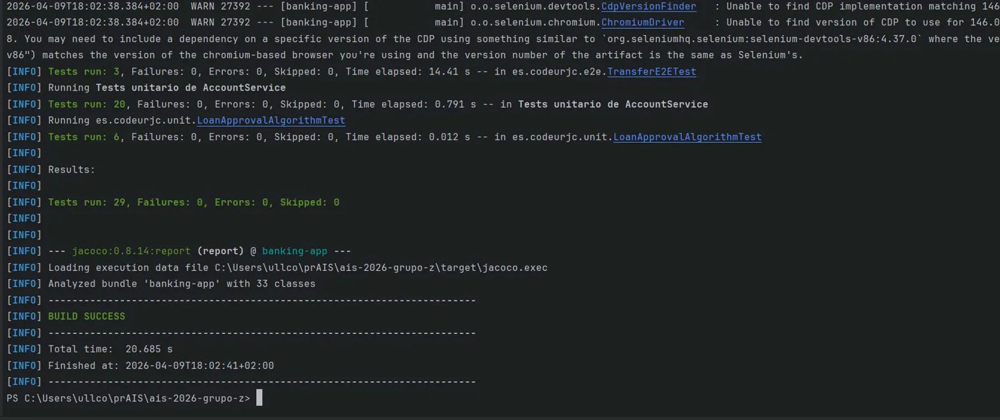

**Refactorización**

Se ha extraído el interés base como constante `BASE_INTEREST` para evitar el magic number 2.0 y facilitar futuros cambios.

```java
private static final double BASE_INTEREST = 2.0;

// ...
double interestRate = BASE_INTEREST + euriborService.getEuribor();
```

**Captura de que TODOS los tests PASAN tras la refactorización**

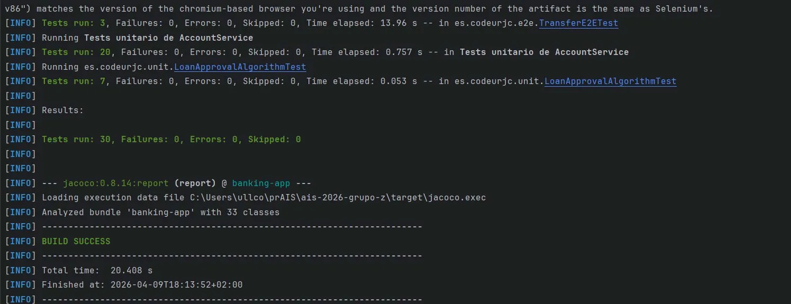

### Se aprueba un préstamo con un Euribor al 3% tendra una cuota de 875 euros al mes

**Código de test**
```java
@Test
@DisplayName("Estrategia TDD: Un prestamo aprobado con Euribor al 3% tiene una cuota de 875€ al mes")
void algorithm_monthlyPayment_euribor3() {
    when(euriborService.getEuribor()).thenReturn(3.0);

    LoanRequest request = new LoanRequest();
    request.setAmount(20000.0);
    request.setTermMonths(24);
    request.setCustomerBalance(5000.0);
    request.setMonthlyIncome(3000.0);

    LoanEvaluationResult result = algorithm.evaluate(request);

    assertTrue(result.isApproved());
    assertEquals(5.0, result.getInterestRate(), 0.01);
    assertEquals(875.0, result.getMonthlyPayment(), 0.01);
}
```

**Mensaje del test añadido que NO PASA**

```log
org.opentest4j.AssertionFailedError: 
Expected :875.0
Actual   :0.0
```
**Código mínimo para que el test pase**

Se ha añadido el cálculo de la cuota mensual

```java
public class LoanApprovalAlgorithm {

    private static final double MIN_AMOUNT = 1000.0;
    private static final double MAX_AMOUNT = 50000.0;
    private static final String VALUE_OUT = "Valor fuera de rango";

    private static final int MIN_TERM = 6;
    private static final int MAX_TERM = 120;
    private static final String TERM_OUT = "Plazo fuera de rango";
    private final EuriborService euriborService;

    public LoanApprovalAlgorithm(EuriborService euriborService) {
        this.euriborService = euriborService;
    }

    public LoanEvaluationResult evaluate(LoanRequest request) {
        if (request.getAmount() < MIN_AMOUNT || request.getAmount() > MAX_AMOUNT) {
            return new LoanEvaluationResult(false ,VALUE_OUT);
        }

        if (request.getTermMonths() < MIN_TERM || request.getTermMonths() > MAX_TERM){
            return new LoanEvaluationResult(false ,TERM_OUT);

        }
        if (request.getCustomerBalance() < request.getAmount() * 0.20) {
            return new LoanEvaluationResult(false, "Saldo insuficiente");
        }

        double interestRate = 2.0 + euriborService.getEuribor();
        double monthlyPayment = (request.getAmount() * (1+ interestRate / 100.0)) / request.getTermMonths();
        return new LoanEvaluationResult(true, "Aprobado", request.getAmount(), interestRate, monthlyPayment);
    }
}
```

**Captura de que TODOS los test PASAN**

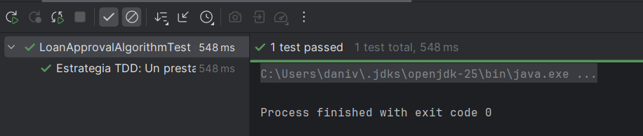

### Se aprueba un préstamo con un Euribor al 3.5% tendra una cuota de 878.17 euros al mes

**Código de test**
```java
@Test
@DisplayName("Estrategia TDD: Un prestamo aprobado con Euribor al 3.5% tiene una cuota de 878.17€ al mes")
void algorithm_monthlyPayment_euribor35() {
    when(euriborService.getEuribor()).thenReturn(3.5);

    LoanRequest request = new LoanRequest();
    request.setAmount(20000.0);
    request.setTermMonths(24);
    request.setCustomerBalance(5000.0);
    request.setMonthlyIncome(3000.0);

    LoanEvaluationResult result = algorithm.evaluate(request);

    assertTrue(result.isApproved());
    assertEquals(5.5, result.getInterestRate(), 0.01);
    assertEquals(878.17, result.getMonthlyPayment(), 0.01);
}
```

**Mensaje del test añadido que NO PASA**
```log
org.opentest4j.AssertionFailedError:
Expected :878.17
Actual   :879.1666666666666
```

Es un error matematico ya que al aplicar la fórmula el valor es 879.17 no 878.17

### Se aprueba un préstamo con un Euribor al 5% tendra una cuota de 891.67 euros al mes

**Código de test**
```java
@Test
@DisplayName("Estrategia TDD: Un prestamo aprobado con Euribor al 5% tiene una cuota de 891.67€ al mes")
void algorithm_monthlyPayment_euribor5() {
    when(euriborService.getEuribor()).thenReturn(5.0);

    LoanRequest request = new LoanRequest();
    request.setAmount(20000.0);
    request.setTermMonths(24);
    request.setCustomerBalance(5000.0);
    request.setMonthlyIncome(3000.0);

    LoanEvaluationResult result = algorithm.evaluate(request);

    assertTrue(result.isApproved());
    assertEquals(7.0, result.getInterestRate(), 0.01);
    assertEquals(891.67, result.getMonthlyPayment(), 0.01);
}
```

**Mensaje del test añadido que  PASA**

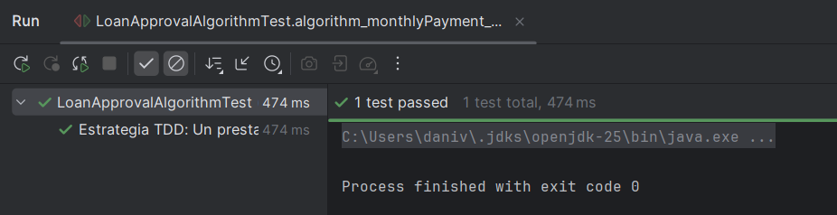

### Se rechaza un préstamo de 20000 euros a 24 meses con euribor a 3% a un cliente con un ingreso de 2000 euros mensuales

**Código de test**
```java
@Test
@DisplayName("Estrategia TDD: Se rechaza el prestamo si la cuota supera el 40% de los ingresos mensuales")
void algorithm_rejected_whenMonthlyPaymentExceeds40PercentOfIncome() {
    when(euriborService.getEuribor()).thenReturn(3.0);

    LoanRequest request = new LoanRequest();
    request.setAmount(20000.0);
    request.setTermMonths(24);
    request.setCustomerBalance(5000.0);
    request.setMonthlyIncome(2000.0);

    LoanEvaluationResult result = algorithm.evaluate(request);

    assertFalse(result.isApproved(), "Este prestamo debe rechazarse porque la cuota supera el 40% de los ingresos");
}
```

**Mensaje del test añadido que NO PASA**

```log
org.opentest4j.AssertionFailedError: Este prestamo debe rechazarse porque la cuota supera el 40% de los ingresos ==> 
Expected :false
Actual   :true
```

**Código mínimo para que el test pase**

Se ha añadido una condición para comprobar si la cuota mensual supera el 40%

```java
public LoanEvaluationResult evaluate(LoanRequest request) {
    if (request.getAmount() < MIN_AMOUNT || request.getAmount() > MAX_AMOUNT) {
        return new LoanEvaluationResult(false ,VALUE_OUT);
    }

    if (request.getTermMonths() < MIN_TERM || request.getTermMonths() > MAX_TERM){
        return new LoanEvaluationResult(false ,TERM_OUT);

    }
    if (request.getCustomerBalance() < request.getAmount() * 0.20) {
        return new LoanEvaluationResult(false, "Saldo insuficiente");
    }

    double interestRate = 2.0 + euriborService.getEuribor();
    double monthlyPayment = (request.getAmount() * (1+ interestRate / 100.0)) / request.getTermMonths();
    if (monthlyPayment > request.getMonthlyIncome() * 0.40) {return new LoanEvaluationResult(false, "Cuota demasiado alta");}
    return new LoanEvaluationResult(true, "Aprobado", request.getAmount(), interestRate, monthlyPayment);
}
```

**Captura de que TODOS los test PASAN**

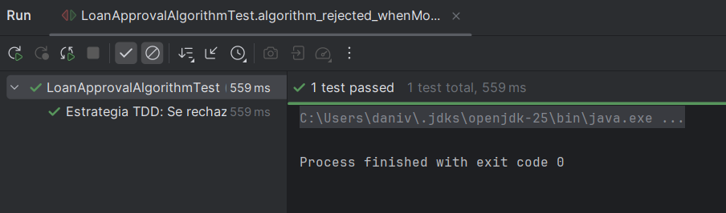

### Se rechaza un préstamo de 20000 euros a 7 meses con euribor a 5% a un cliente con un ingreso de 3000 euros mensuales

**Código de test**
```java
@Test
@DisplayName("Estrategia TDD: Se rechaza el prestamo si el plazo corto hace que la cuota supere el 40% de los ingresos")
void algorithm_rejected_whenShortTermMakesMonthlyPaymentTooHigh() {
    when(euriborService.getEuribor()).thenReturn(5.0);

    LoanRequest request = new LoanRequest();
    request.setAmount(20000.0);
    request.setTermMonths(7);
    request.setCustomerBalance(5000.0);
    request.setMonthlyIncome(3000.0);

    LoanEvaluationResult result = algorithm.evaluate(request);

    assertFalse(result.isApproved(), "Este prestamo debe rechazarse porque la cuota supera el 40% de los ingresos");
    assertEquals("Cuota demasiado alta", result.getReason());
}
```

**Mensaje del test añadido que PASA**

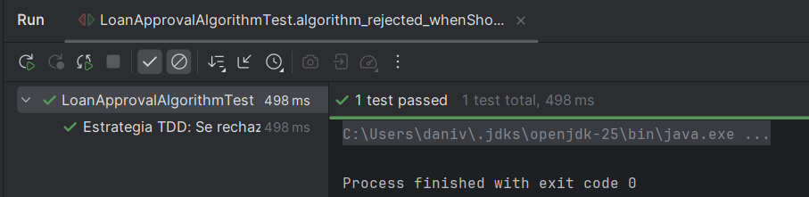

### Se acepta un préstamo de 20000 euros a 24 meses con euribor a 3% a un cliente con un ingreso de 3000 euros mensuales

**Código de test**
```java
@Test
@DisplayName("Estrategia TDD: Se aprueba el prestamo si la cuota no supera el 40% de los ingresos")
void algorithm_approved_whenMonthlyPaymentIsWithin40PercentOfIncome() {
    when(euriborService.getEuribor()).thenReturn(3.0);

    LoanRequest request = new LoanRequest();
    request.setAmount(20000.0);
    request.setTermMonths(24);
    request.setCustomerBalance(5000.0);
    request.setMonthlyIncome(3000.0);

    LoanEvaluationResult result = algorithm.evaluate(request);

    assertTrue(result.isApproved(), "Este prestamo debe aprobarse porque la cuota no supera el 40% de los ingresos");
    assertEquals("Aprobado", result.getReason());
    assertEquals(875.0, result.getMonthlyPayment(), 0.01);
}
```

**Mensaje del test añadido que PASA**

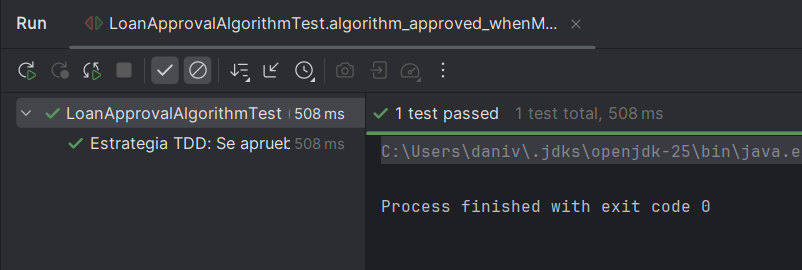